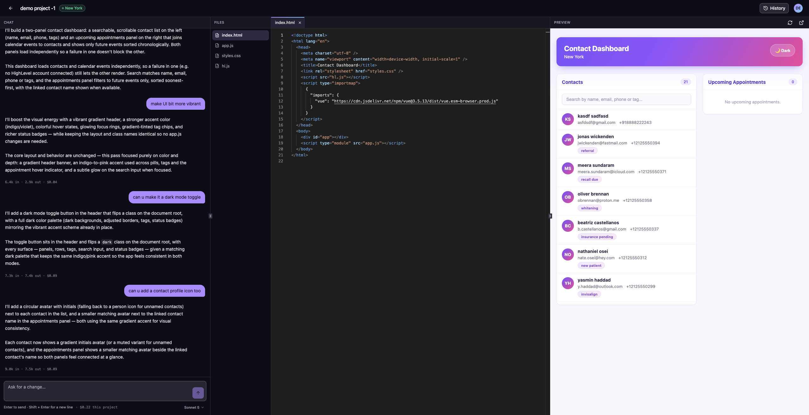
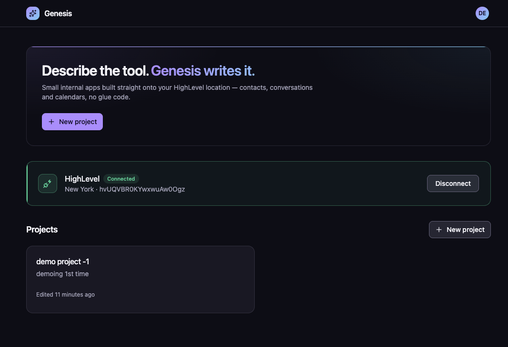
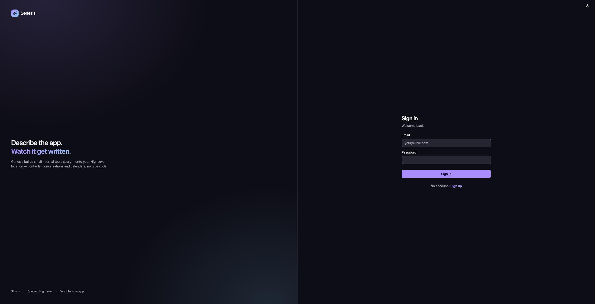
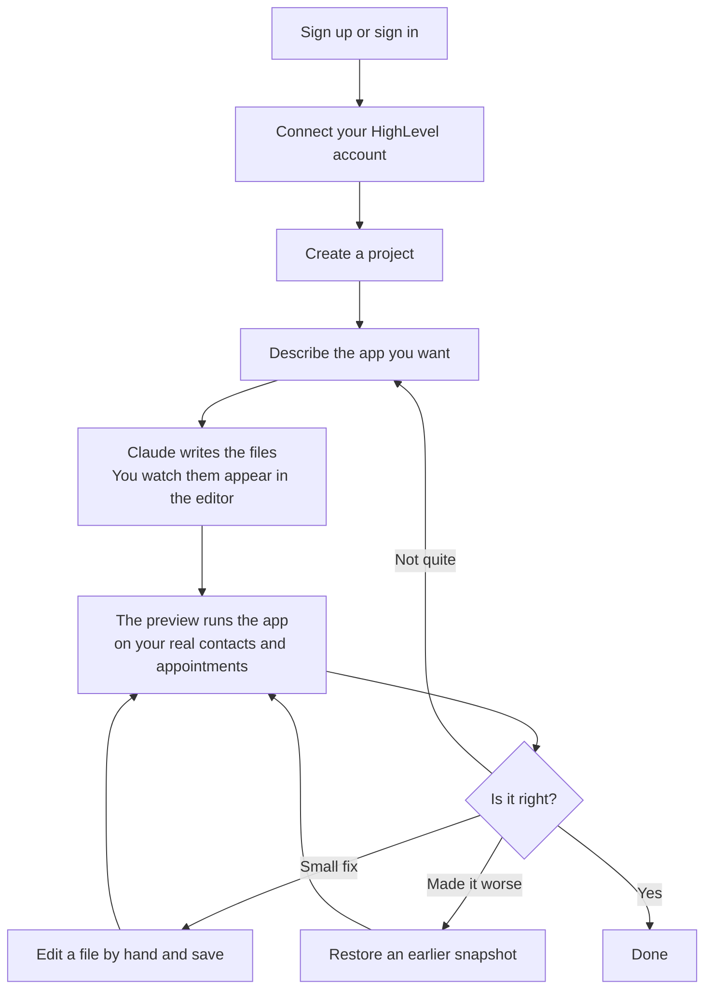

# Genesis — AI-Powered HighLevel App Builder

[](https://github.com/jason-bourne-gg/genesis-highlevel-app-builder/actions/workflows/ci.yml)

**Genesis builds small business apps by writing the code itself.**

Sign in, connect your HighLevel account, and type what you want in plain English —
*"show me this week's appointments next to the contact who booked them."* Claude
writes the app while you watch, file by file. The finished app appears beside the
editor, already running on your own real contacts and appointments.

HighLevel is a CRM sold to agencies; each client gets a sub-account it calls a
**location**. Genesis builds apps that plug into one location and show that
business's data.

**[Live](https://genesysbe-cbd7e.web.app)** · **[Loom walkthrough](https://www.loom.com/share/7af776bf596c4a14824270543d8a56dd)** · Vue 3 + TypeScript on Firebase, Claude via `@anthropic-ai/sdk`


*A dashboard written by Claude, running sandboxed, on real contacts from a HighLevel sub-account.*

| | |
| --- | --- |
|  |  |
| Projects and the connected location | Sign in |

---

## The user journey

What actually happens, from the point of view of the person using it.



Every generation saves a snapshot, a copy of all the project files at that moment,
so any earlier version can be brought back. Projects can be renamed and their
description edited from the dashboard; deleting one hides it rather than removing it.

---

## Three decisions

**Generated code is untrusted, throughout.** It runs in a sandboxed frame on an
opaque origin, no tokens ever reach the browser, and every HighLevel call is
re-checked server-side. The model wrote it; that is reason enough not to trust it.

**Streaming forced its own address.** `generate` streams Claude's output as it is
written, and streaming has to be called at the Cloud Run URL rather than through
the Functions gateway. That one constraint shapes the request path.

**Writes and extended reads ship dark.** Both sit behind per-account feature flags,
off by default, so the risky half of the surface is opt-in per location.

**539 tests, 91% coverage.**

---

## Run it

```bash
npm install && npm run build
npm run dev          # http://localhost:6001
npm test
```

Needs `functions/.env` and `frontend/.env` — see `.env.example`.

**[Architecture](docs/ARCHITECTURE.md)** — the request path, feature flags, the
decisions in full, and what I would improve.
**[Setup](docs/SETUP.md)** — connecting HighLevel, local Firebase, deployment.
