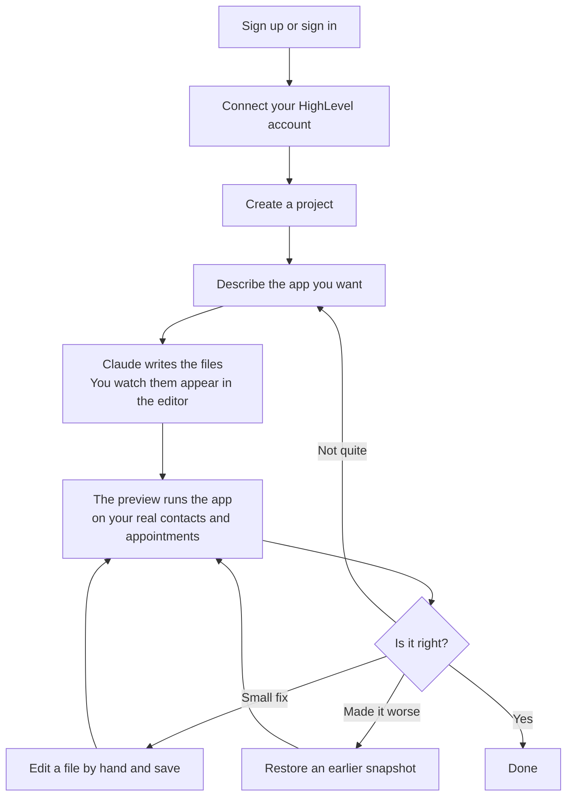
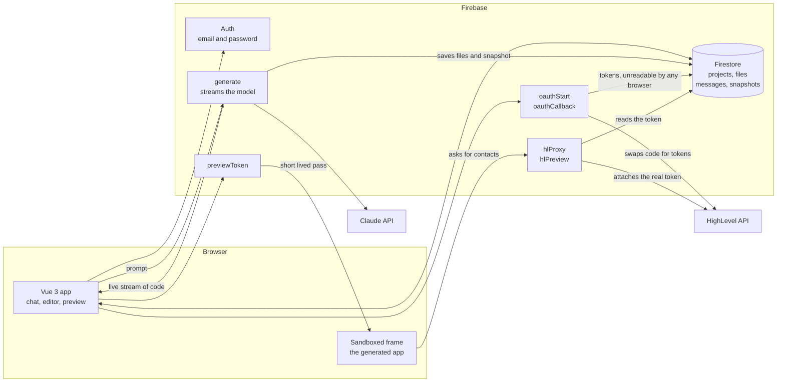

# Genesis — AI-Powered HighLevel App Builder

Genesis builds small business apps for you by writing the code itself.

You sign in, connect your HighLevel account, and type what you want in plain
English: "show me this week's appointments next to the contact who booked them."
Claude writes the app while you watch, file by file, in a code editor on screen.
The finished app appears in a panel beside it, already running on your own real
contacts and appointments. You can edit any file by hand, and step back to an
earlier version at any time.

HighLevel is a CRM sold to agencies. Each client of an agency gets a sub-account,
which HighLevel calls a **location**: one location is one business, with its own
contacts, conversations and calendars. Genesis builds apps that plug into a single
location and show that business's data.

The name and the brief are HighLevel's. This repository is my implementation, in
Vue 3 and TypeScript on Firebase, with Claude through `@anthropic-ai/sdk`.

## The user journey

What actually happens, from the point of view of the person using it.



Every generation saves a snapshot, a copy of all the project files at that moment,
so any earlier version can be brought back.

## Live URLs

| What | URL |
| --- | --- |
| Frontend (Firebase Hosting) | **TODO — not deployed yet** |
| Cloud Functions base | `https://us-central1-genesysbe-cbd7e.cloudfunctions.net` |
| `generate` (direct Cloud Run URL) | `https://generate-ykls45eqcq-uc.a.run.app` |
| Loom walkthrough | **TODO** |

Under the functions base: `oauthStart`, `oauthCallback`,
`hlProxy/{location|contacts|conversations|events}`, `hlDisconnect`,
`previewToken`, `hlPreview/{resource}`.

`generate` is deliberately not one of them. It streams Claude's output as it is
written, and streaming has to be called at its own Cloud Run address. Cloud Run is
the Google service the functions actually run on, and it gives each one a second
URL. Decision 1 explains why that matters.

## HighLevel setup

You need a HighLevel agency developer account, a marketplace app, and one
sub-account with data in it.

1. **Create the app** at marketplace.gohighlevel.com with **sub-account**
   distribution. Mine is "APP Builder", app ID `6a996ece5c8bc5c99d201e30`, still a
   draft. A draft is enough to install into your own location.
2. **Copy the client keys** from `MANAGE > Secrets > Client keys` into
   `HL_CLIENT_ID` and `HL_CLIENT_SECRET`.
3. **Tick the read scopes** and put the same list in `HL_SCOPES`. A scope is one
   named permission:
   `locations.readonly contacts.readonly conversations.readonly calendars.readonly calendars/events.readonly`
4. **Register the redirect URL** under `Advanced Settings > Auth > Redirect URLs`.
   That is where HighLevel returns the browser after you approve access, and it
   must match `HL_REDIRECT_URI` exactly:
   `https://us-central1-genesysbe-cbd7e.cloudfunctions.net/oauthCallback`
5. **Copy the version ID** from the app's Install link into `HL_VERSION_ID`.
6. **Create a sandbox location**, add contacts, a calendar and a few appointments,
   then install the app into it. Mine is `hvUQVBR0KYwxwuAw0Ogz` ("New York"), 15
   contacts, one calendar.

Three things here cost real time:

- HighLevel **rejects any redirect URL containing the string "highlevel"**. The
  first Firebase project was named `goHighLevel`, poisoning every URL it could
  produce. Project IDs are permanent, so it had to be recreated as
  `genesysbe-cbd7e`.
- A **draft app has no published version**, so the approval URL has to name one
  with `version_id`. That is what step 5 is for.
- The approval URL is `.../v2/oauth/chooselocation`, not the path most of the
  documentation gives. Found by reading the Install link HighLevel generated.

## Local setup

**Node 22 is required.** Node 20 cannot load one of Firebase's dependencies, and
Google switches the Node 20 cloud runtime off on 2026-10-30.

```bash
# 1. Fill in the two env files described at the top of .env.example
#    (functions/.env and frontend/.env). Both are gitignored.

# 2. Install and build
cd frontend  && npm install
cd functions && npm install && npm run build

# 3. The app, at http://localhost:6001
cd frontend && npm run dev

# 4. Local Firebase, from the repo root
firebase emulators:start

# 5. Tests
cd functions && npm test
```

Port 6001, not 6000. Port 6000 is the X11 port and browsers refuse to connect to
it.

Emulator ports come from `firebase.json`: Auth 9099, Functions 5001, Firestore
8080, Hosting 5000. Functions are served out of `functions/lib`, so the build has
to run first. To point the app at local functions rather than deployed ones, set
these in `frontend/.env`:

```
VITE_FUNCTIONS_BASE=http://localhost:5001/genesysbe-cbd7e/us-central1
VITE_GENERATE_URL=http://localhost:5001/genesysbe-cbd7e/us-central1/generate
```

`npm test` runs the stream-parser test. The parser splits Claude's output into
separate files as it arrives, and it is the one place here where a bug is
invisible: a file boundary marker split across two chunks corrupts a file
silently. The test feeds the same output through at every possible split point and
checks the result is identical each time.

**The emulator cannot connect a HighLevel account.** HighLevel has to redirect your
browser to our callback URL, and it cannot reach `localhost`. That flow is tested
against deployed functions.

## Architecture

Three parties: the browser, our own small backend, and two outside services. The
browser never holds a HighLevel credential and never talks to Claude.



Two edges are load-bearing:

- **`generate` is called at its Cloud Run address, not through Firebase Hosting.**
  Hosting holds a whole response at its edge cache before releasing any of it, so
  code meant to appear gradually would arrive all at once at the end.
- **The frame never receives a HighLevel token.** It gets a short-lived pass scoped
  to one project, and the proxy attaches the real credential on the server.

## Architecture decisions

1. **The streaming endpoint is called at its own Cloud Run address, never through
   Firebase Hosting.** Hosting holds the whole response at its edge cache before
   sending any of it, so text meant to appear gradually arrives all at once at the
   end. The single most important constraint in the project, and the reason
   `VITE_GENERATE_URL` is a separate setting.

2. **Generated apps are four plain files with no build step.** Vue loads from a
   public CDN, so nothing is compiled and the app runs the moment the last
   character is written. Browser bundlers like Sandpack or WebContainers would each
   cost a day of setup and add new ways for a live demo to break, and a real
   HighLevel marketplace app is itself a page embedded in a frame, so a
   self-contained page is the accurate shape rather than a shortcut. The cost:
   generated apps cannot use npm packages.

3. **Every file is stored as its own database record.** That makes the file tree,
   the editor tabs, manual saves and version history genuinely per-file instead of
   one blob chopped up for display. Browser and server derive record IDs from the
   file path identically, so a file always lands in the same place whoever writes
   it.

4. **We write the HighLevel client library, not the model.** `hl.js` is the small
   file a generated app uses to fetch data: four methods, documented in the prompt,
   and the model may not emit any file other than `index.html`, `app.js` and
   `styles.css`. A narrow documented surface is what stops the model inventing
   endpoints that do not exist.

5. **Input from the browser is treated as untrusted, in four separate places.** The
   preview runs in a sandboxed frame with no access to the surrounding page,
   HighLevel is reached only through our server, the HighLevel access token never
   reaches the browser at all, and the model chosen in the picker is re-checked
   against a list on the server before any request is made, because an unchecked
   model name from the browser is an unbounded bill on someone else's account. This leaked once: an "open in new tab" button
   used a `blob:` URL, and those inherit the identity of the page that created
   them, so generated code could have read the signed-in session out of browser
   storage. It now opens a bare shell with a sandboxed frame inside.

6. **The preview gets a short-lived pass rather than the real credential.** A
   sandboxed frame has no identity of its own and carries no session, so it cannot
   prove who it is. It gets a random string instead, minted per render, tied to one
   project, valid 15 minutes, checked against the database on every call. A lookup
   rather than a signed token, because it can be revoked and there is less to get
   wrong.

7. **Refreshing the HighLevel token happens inside a database transaction.**
   HighLevel refresh tokens are single use: spend one, get a new one, the old one
   dies. Two requests refreshing at the same moment would spend the same token and
   break the connection permanently. The transaction forces them into a queue.

8. **The server saves the work, not the browser.** Files, messages and the version
   snapshot are written server-side in one commit, even if the user closed the tab,
   because the work is already paid for. The browser finds out by subscribing to
   the database, so a second tab sees it too.

9. **A file is saved only once its closing marker arrives.** Anything still open
   when the stream stops is a truncation, not a file, and is discarded. A run that
   finishes without producing `index.html` also counts as failed, because there is
   nothing left to render.

10. **Deleting only marks a project deleted, and the list is sorted in the browser.**
    Really removing a project means walking every attached record, and a mis-click
    costing someone their whole history is worse than a row that stays in the
    database, so delete just sets a flag and the dashboard hides those rows. Hiding
    them *and* ordering by recency inside the query would need a composite database
    index, which has to be deployed and finish building before the dashboard can
    render at all. For one person's project list, tens of records, the filter and
    the sort are free in the browser and the app has one less thing it cannot start
    without. When the list is big enough to need paging, the index goes in and the
    ordering moves back to the query.

## What I would improve

- **Generated apps can only read.** The proxy exposes four read-only calls, so
  "let me update this contact's phone number" cannot be satisfied at all. Adding
  writes means a small set of safe changes, each confirmed in the UI, because the
  code requesting it was written by a model.

- **Pagination and caching for HighLevel data.** Contacts stop at 100,
  conversations at 50, appointments at a 30-day forward window, with no paging and
  no cache beyond one page load. A busy location hits those ceilings immediately.

- **A rate limit and a spend ceiling on generation.** Nothing stops one account
  generating back to back until the Anthropic budget is gone.

- **Per-file restore and a diff view.** Restoring rewrites the whole file set in one
  commit, which is correct but blunt. Showing what changed between two versions is
  what people actually want from history.

- **Tests past the parser.** The OAuth exchange, the single-use token refresh and
  the preview pass are the parts most likely to break quietly, and none has
  automated coverage.

## Deployment notes

**Firebase project.** `genesysbe-cbd7e`, region `us-central1`, set in `.firebaserc`.
The **Blaze (pay as you go) plan is required**, because current-generation Cloud
Functions run on Cloud Run and the free plan does not include it. Enable
Email/Password sign-in and create the Firestore database before the first deploy.

**Deploy in this order.** Rules first, because everything else depends on them.

```bash
firebase deploy --only firestore:rules

cd functions && npm run build && cd ..
firebase deploy --only functions

cd frontend && npm run build && cd ..
firebase deploy --only hosting
```

`firestore.indexes.json` is deliberately empty. No query in the app needs a
composite index, so there is nothing to build and nothing that can be missing when
someone first opens the page. See architecture decision 10.

**Get the Cloud Run URL for `generate`.** The manual step that matters most.
`firebase deploy --only functions` prints every function's URL when it finishes;
the Cloud Run one looks like `https://generate-<hash>-uc.a.run.app`. It is also in
the Google Cloud console under Cloud Run, as the service named `generate`. Put it
in `frontend/.env` as `VITE_GENERATE_URL` and rebuild the frontend. Never point it
at a Firebase Hosting path, for the reason in decision 1.

**Environment variables.** Functions read `functions/.env`, bundled at deploy time,
so a change means redeploying functions. Frontend values are compiled into the
bundle, so a change means rebuilding and redeploying Hosting. Neither file is
committed; `.env.example` documents both.

**Set `APP_ORIGIN`.** The OAuth callback returns the browser to whatever
`APP_ORIGIN` says, defaulting to `http://localhost:6001`. In production it must be
the deployed Hosting origin, or everyone who connects an account lands on their own
localhost.

**HighLevel side.** Register the deployed callback URL in the marketplace app,
matching `HL_REDIRECT_URI` exactly, and keep `HL_VERSION_ID` filled in while the app
is a draft. Both traps are covered under HighLevel setup.

**CI/CD.** There is none. No GitHub Actions, no automated deploy, no staging
environment. Every deploy is the commands above, run by hand. For a five-day build
by one person that was the right trade, but it is a real gap and worth naming.
