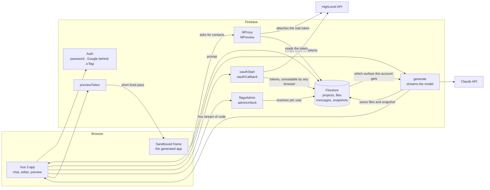

# Architecture

How Genesis is put together, and why.

---

## Live URLs

| What | URL |
| --- | --- |
| Frontend (Firebase Hosting) | https://genesysbe-cbd7e.web.app |
| Feature flag admin | https://genesysbe-cbd7e.web.app/admin/flags |
| Cloud Functions base | `https://us-central1-genesysbe-cbd7e.cloudfunctions.net` |
| `generate` (direct Cloud Run URL) | `https://generate-ykls45eqcq-uc.a.run.app` |
| Loom walkthrough | https://www.loom.com/share/7af776bf596c4a14824270543d8a56dd |

Under the functions base: `oauthStart`, `oauthCallback`, `hlDisconnect`,
`previewToken`, `flagsAdmin`, `adminUnlock`, and the two proxies.

The proxies serve the same resources, differing only in who may call them:
`hlProxy/{resource}` takes a Firebase ID token, `hlPreview/{resource}` takes a preview
badge because the sandboxed frame has no session to present.

| Resource | Method | Gate |
| --- | --- | --- |
| `location`, `contacts`, `conversations`, `events` | GET | none |
| `search?q=`, `messages?conversationId=` | GET | `hl_extended_reads` |
| `calendars`, `slots?calendarId=&days=` | GET | either flag |
| `createContact`, `updateContact`, `sendMessage`, `bookAppointment` | POST | `hl_writes` |

`generate` is deliberately not one of them. It streams Claude's output as it is
written, and streaming has to be called at its own Cloud Run address. Cloud Run is
the Google service the functions actually run on, and it gives each one a second
URL. Decision 1 explains why that matters.

The flag admin is reachable by any signed-in account; the flags themselves stay hidden
until the root credential is entered on the page. See Feature flags below.

---

## Architecture

Three parties: the browser, our own small backend, and two outside services. The
browser never holds a HighLevel credential and never talks to Claude.

Two edges are load-bearing:

- **`generate` is called at its Cloud Run address, not through Firebase Hosting.**
  Hosting holds a whole response at its edge cache before releasing any of it, so
  code meant to appear gradually would arrive all at once at the end.
- **The frame never receives a HighLevel token.** It gets a short-lived pass scoped
  to one project, and the proxy attaches the real credential on the server.

---

## Architecture decisions

1. **The streaming endpoint is called at its own Cloud Run address, never through
   Firebase Hosting.** Hosting holds the whole response at its edge cache before
   sending any of it, so text meant to appear gradually arrives all at once at the
   end. The single most important constraint in the project, and the reason
   `VITE_GENERATE_URL` is a separate setting.

2. **Generated apps are four plain files with no build step.** Vue loads from a
   public CDN, so nothing is compiled and the app runs the moment the last
   character is written. Browser bundlers like Sandpack or WebContainers would each
   cost a day of setup and add new ways for a live demo to break, and a real
   HighLevel marketplace app is itself a page embedded in a frame, so a
   self-contained page is the accurate shape rather than a shortcut. The cost:
   generated apps cannot use npm packages.

3. **Every file is stored as its own database record.** That makes the file tree,
   the editor tabs, manual saves and version history genuinely per-file instead of
   one blob chopped up for display. Browser and server derive record IDs from the
   file path identically, so a file always lands in the same place whoever writes
   it.

4. **We write the HighLevel client library, not the model.** `hl.js` is the small
   file a generated app uses to fetch data: four methods, documented in the prompt,
   and the model may not emit any file other than `index.html`, `app.js` and
   `styles.css`. A narrow documented surface is what stops the model inventing
   endpoints that do not exist.

5. **Input from the browser is treated as untrusted, in four separate places.** The
   preview runs in a sandboxed frame with no access to the surrounding page,
   HighLevel is reached only through our server, the HighLevel access token never
   reaches the browser at all, and the model chosen in the picker is re-checked
   against a list on the server before any request is made, because an unchecked
   model name from the browser is an unbounded bill on someone else's account. This leaked once: an "open in new tab" button
   used a `blob:` URL, and those inherit the identity of the page that created
   them, so generated code could have read the signed-in session out of browser
   storage. It now opens a bare shell with a sandboxed frame inside.

6. **The preview gets a short-lived pass rather than the real credential.** A
   sandboxed frame has no identity of its own and carries no session, so it cannot
   prove who it is. It gets a random string instead, minted per render, tied to one
   project, valid 15 minutes, checked against the database on every call. A lookup
   rather than a signed token, because it can be revoked and there is less to get
   wrong.

7. **Refreshing the HighLevel token happens inside a database transaction.**
   HighLevel refresh tokens are single use: spend one, get a new one, the old one
   dies. Two requests refreshing at the same moment would spend the same token and
   break the connection permanently. The transaction forces them into a queue.

8. **The server saves the work, and the connection is not a control channel.**
   Files, messages and the version snapshot are written by the function, so closing
   the tab mid-generation still saves what was produced. The same reasoning applies
   to stopping: a browser hanging up does not reliably reach the container through
   Cloud Run, so Stop is not a dropped connection but an explicit flag the function
   watches for. Relying on the disconnect meant Stop appeared to work while the
   generation ran on, overwrote the files and billed in full.

9. **A file is saved only once its closing marker arrives.** Anything still open
   when the stream stops is a truncation, not a file, and is discarded. A run that
   finishes without producing `index.html` also counts as failed, because there is
   nothing left to render.

10. **Deleting only marks a project deleted, and the list is sorted in the browser.**
    Really removing a project means walking every attached record, and a mis-click
    costing someone their whole history is worse than a row that stays in the
    database, so delete just sets a flag and the dashboard hides those rows. Hiding
    them *and* ordering by recency inside the query would need a composite database
    index, which has to be deployed and finish building before the dashboard can
    render at all. For one person's project list, tens of records, the filter and
    the sort are free in the browser and the app has one less thing it cannot start
    without. When the list is big enough to need paging, the index goes in and the
    ordering moves back to the query.

---

## Feature flags

Three flags, all off by default. With every flag off the app behaves exactly as it did
before they existed — the model even receives the byte-identical system prompt.

- `hl_writes` — generated apps can create and update contacts, send messages and book
  appointments. Brings `hl.calendars.list()` and `hl.calendars.slots()` with it, because
  booking needs a calendar and a free time.
- `hl_extended_reads` — adds `hl.contacts.search()` and `hl.conversations.messages()`.
- `google_login` — shows "Continue with Google" on the sign-in page. Read before anyone
  is signed in, so it is the one flag that cannot be targeted at a user.

Each flag has two gates, the way Flipper does it: on for everyone, or on for a list of
accounts. Either is enough, so "off for all but these three" needs no second flag.

The admin is at `/admin/flags`. Pick a flag from the dropdown and every account in the
project is listed with a switch each; the global gate sits above them and says plainly
that it overrides the list.

- **Any signed-in account can open the page.** The flags stay hidden until the root
  credential is entered on it. `adminUnlock` compares that against `ROOT_USERNAME` /
  `ROOT_PASSWORD` in `functions/.env` and returns a 30-minute pass, scoped to that
  account and held in memory by the page, so the caller keeps their own session. Closer
  to sudo than to a second sign-in, and a reload re-locks it.
- **Not a persistent claim.** An earlier version signed a root username in as a real
  Firebase user carrying a permanent `root` claim, which made the rate limit bypassable:
  that account could be signed in directly through Firebase's own REST endpoint with the
  public web API key, and clearing the environment variables did not revoke it.
- Rate limited to 10 attempts per account per 15 minutes, plus a shared 60 so creating
  accounts cannot farm fresh budgets. Keyed on the authenticated uid rather than an
  address, because `X-Forwarded-For` is a list the caller can prepend to and neither end
  of it is safe to key a limit on. It fails closed.
- Emails are resolved live from Firebase Auth for the admin UI and never written into the
  flag documents, which are world-readable because the sign-in page has to resolve
  `google_login` before anyone is signed in.
- Flags are read straight from Firestore, so flipping one takes effect in every open tab
  with no reload. Rules allow reads and deny writes; `flagsAdmin` is the only way in, and
  it re-checks root on every call.
- `generate` resolves the flags before building the prompt, so the model is only ever
  told about calls that will actually work for that user. A test asserts exactly that:
  every documented `hl` call must be one the proxy would serve under the flags that
  documented it.

---

## Writes

- `hl.contacts.create` / `update`, `hl.conversations.send`, `hl.calendars.book`.
- Every write opens a confirmation dialog rendered by `hl.js` in a shadow root. The model
  cannot skip it, because calling the method is the only route to the endpoint it has.
- That stops mistakes, not malice: the badge sits in the same document as the generated
  code. A server-side field allowlist, a 25-write budget per badge and an audit log are
  what cover the rest.
- Fields are allowlisted and coerced server side. `locationId` is never sent on an update,
  because including it is how a record moves between sub-accounts.

---

## What I would improve

- **The generated-code surface is not fully hardened.** Writes are flag-gated,
  confirmed in the UI and budgeted per preview, but nothing reverses one — a journal
  with a revert action is the missing half, and what I would build before turning
  writes on for anyone but myself. Separately the sandbox is a data boundary and not a
  resource one: generated code cannot reach the page or its storage, but an infinite
  loop hangs that tab and outbound `fetch` is unrestricted. A CSP on the frame closes
  the second.

- **Pagination and caching for HighLevel data.** Contacts stop at 100,
  conversations at 50, appointments at a 30-day forward window, with no paging and
  no cache beyond one page load. A busy location hits those ceilings immediately.

- **A spend ceiling, not just a spend meter.** Every generation now records its
  token counts and dollar cost on the message, as a running project total, and as a
  structured log entry. Nothing stops a user running generations back to back until
  the budget is gone. Per-user and per-day limits are the missing half.

- **Per-file restore and a diff view.** Restoring rewrites the whole file set in one
  commit, which is correct but blunt. Showing what changed between two versions is
  what people actually want from history.

- **The last of the coverage is the handlers.** 91% of statements and branches, and
  what remains is HTTP wiring: driving `onRequest` means building a request Express and
  the CORS middleware accept, at which point the test asserts the mock rather than the
  code. An integration test against the emulator is the honest way to close it, and the
  emulator needs a JVM.

